# Fase 3 — Diagramas UML

**Entregable:** Diagramas UML modelados a partir de los requerimientos de la fase 2.

Cada diagrama está exportado en `.png` para verse directamente en GitHub. Cuando existe,
el archivo fuente editable (`.drawio`) se conserva junto a la imagen con el mismo nombre base.

## Casos de uso

Fuente: [`casos-de-uso.drawio`](diagramas/casos-de-uso/casos-de-uso.drawio)

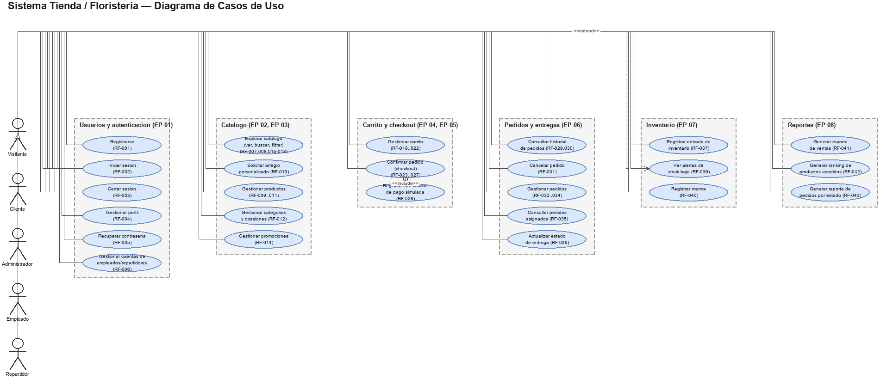

## Clases

Fuente: [`clases.drawio`](diagramas/clases/clases.drawio)

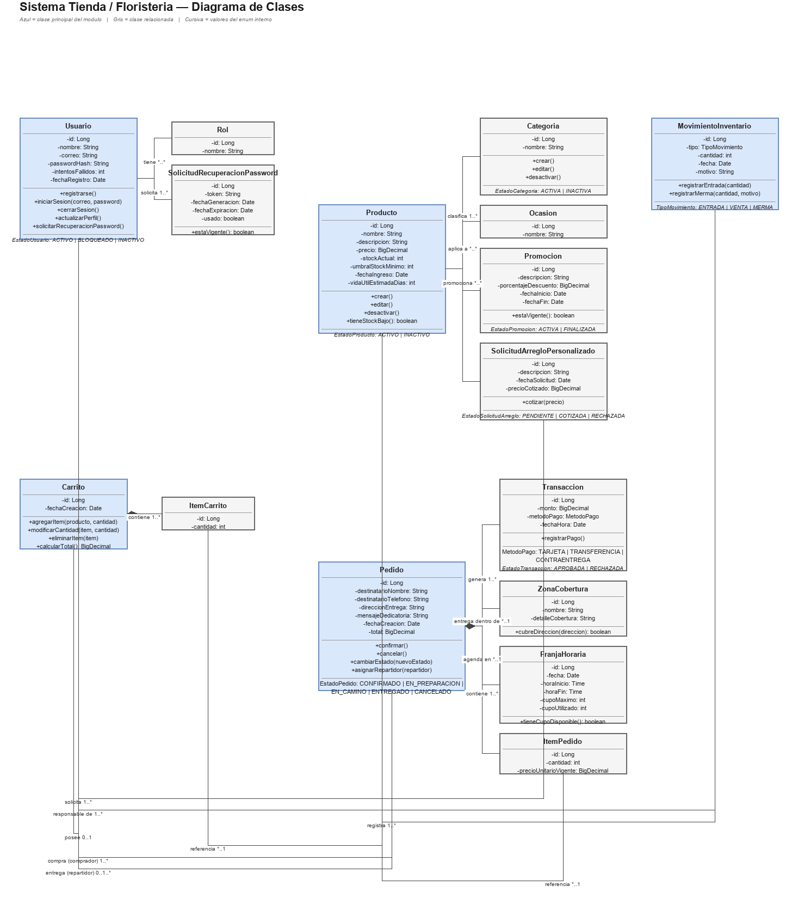

## Secuencia

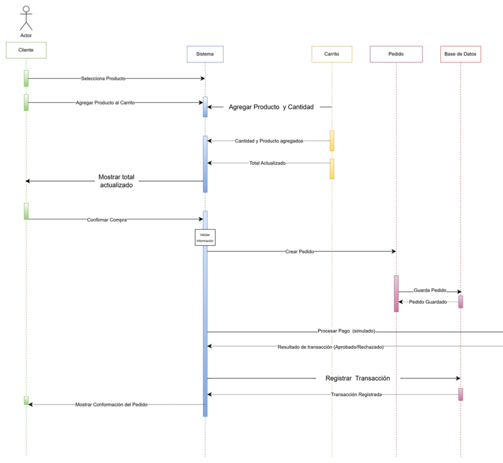

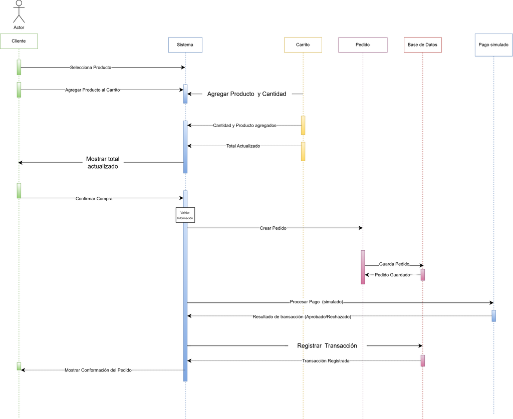

## Actividades

### General

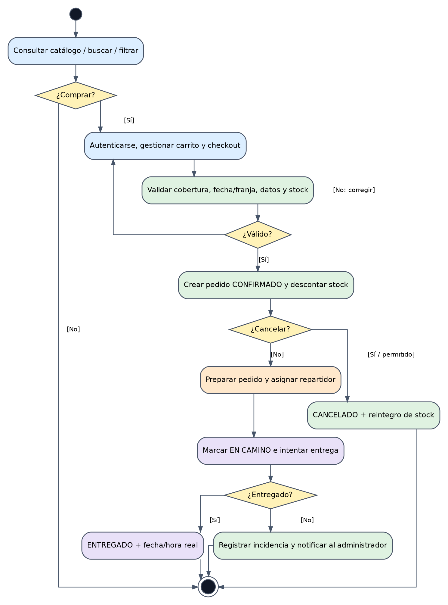

### Catálogo y carrito

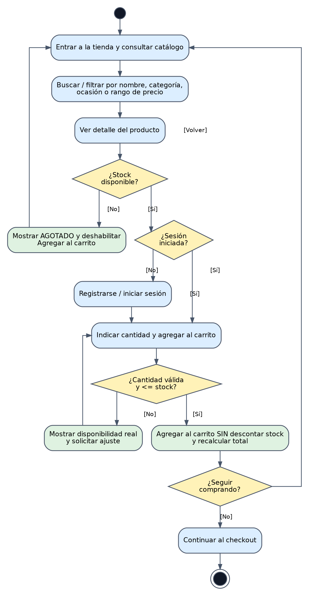

### Checkout y confirmación

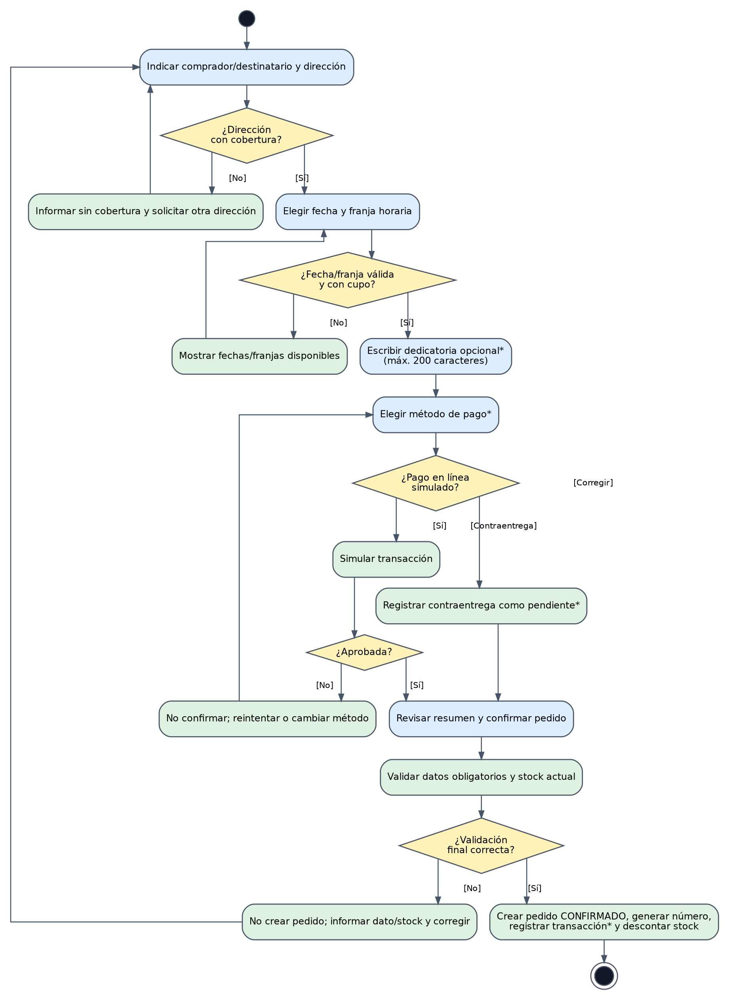

### Gestión del pedido y entrega

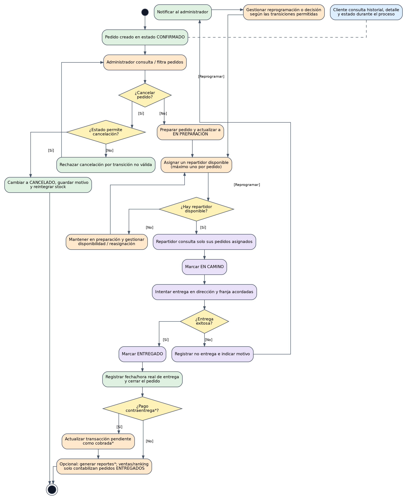

### Inventario y merma

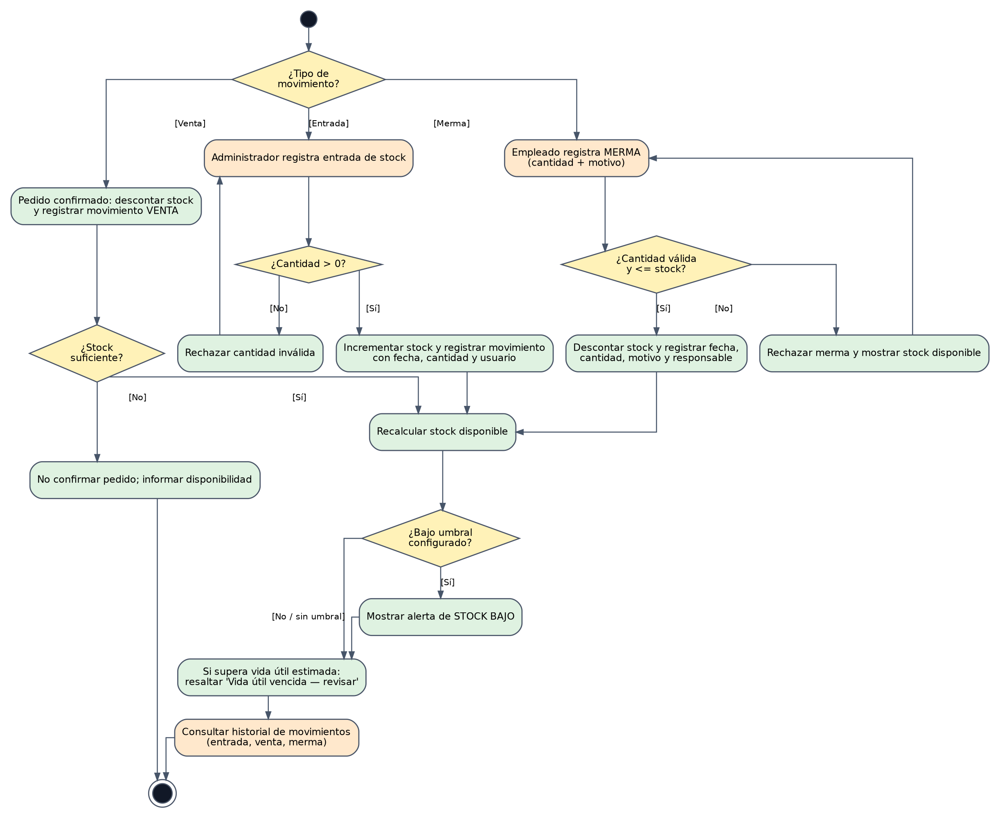

### Pedido

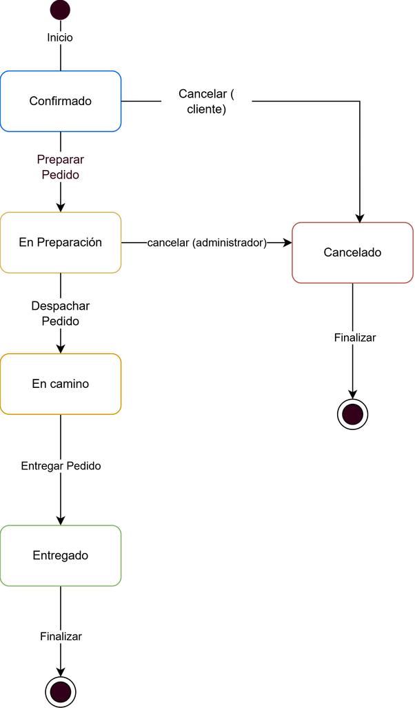

## Estados

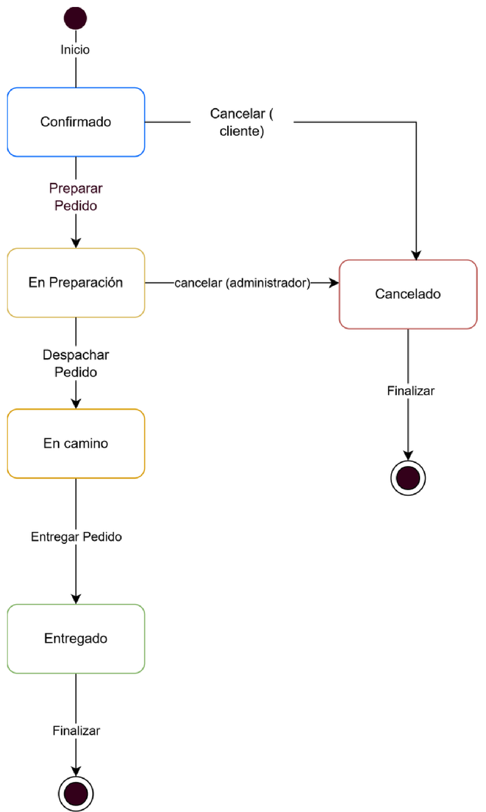

## Componentes

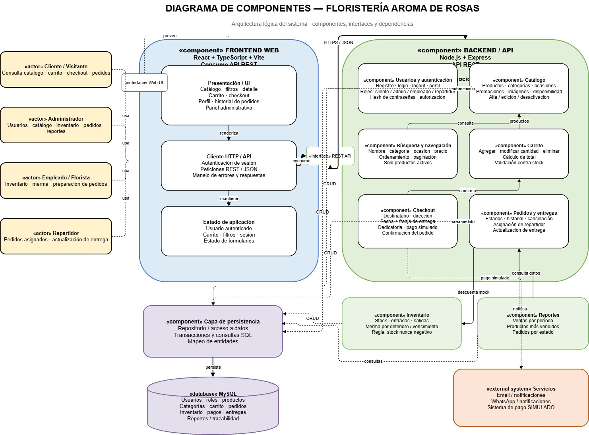

## Despliegue

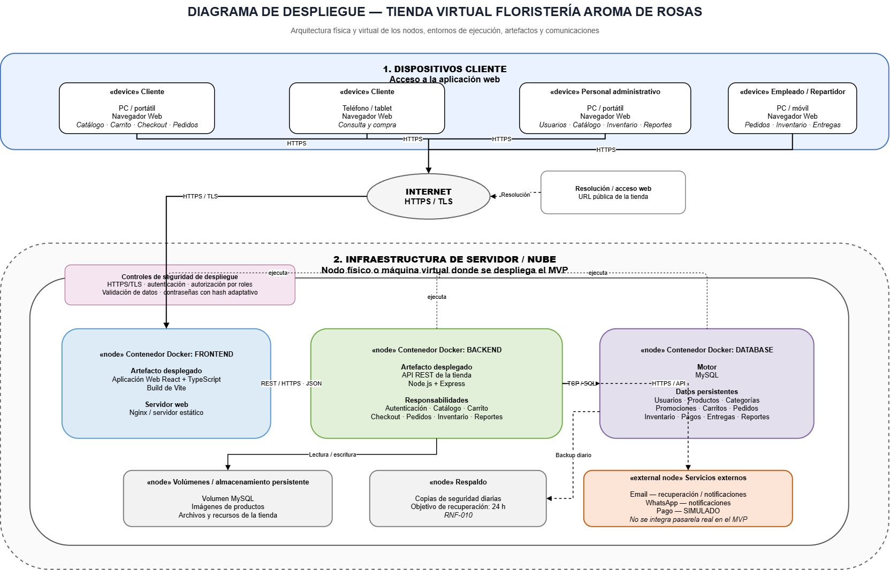
