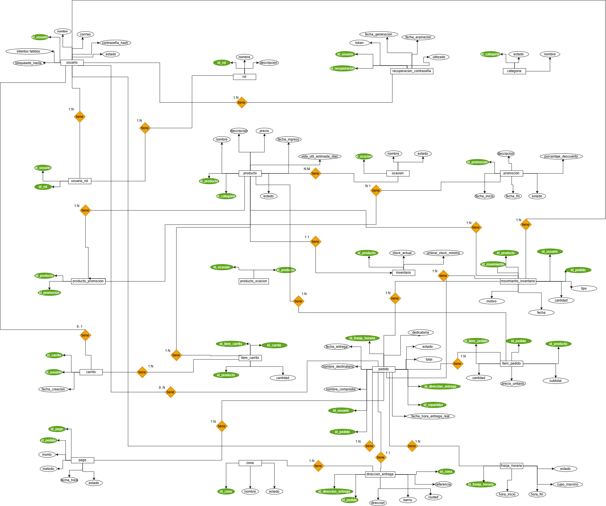

# Fase 4 — Base de datos

**Entregable:** Modelo ER/UML + script SQL.

## Contenido

- `modelos/` — modelo conceptual, modelo lógico y modelo físico (imagen + fuente editable)
- `scripts/01-crear-tablas.sql` — DDL con claves primarias, foráneas y restricciones
- `scripts/02-datos-prueba.sql` — `INSERT` de datos de prueba
- `scripts/03-consultas.sql` — consultas de verificación
- `diccionario-de-datos.md` — descripción de cada tabla, campo, tipo y restricción

## Entregado

- [Modelo conceptual (MER)](modelos/modelo_conceptual_mer/modelo_conceptual.png)
- [Modelo integrado](modelos/modelo-integrado.md) — entidades, atributos, claves, relaciones y diccionario de datos consolidado
- [Modelo físico](modelos/modelo-fisico.md) — motor, tipos, acciones referenciales e índices
- [Script de creación de tablas](scripts/01-crear-tablas.sql)

## Criterios

- El modelo debe quedar normalizado **hasta 3FN**.
- Toda tabla tiene clave primaria definida.
- Toda relación tiene su clave foránea con la acción `ON DELETE` / `ON UPDATE` declarada.
- Los scripts deben ejecutarse en orden y sin errores desde cero.
