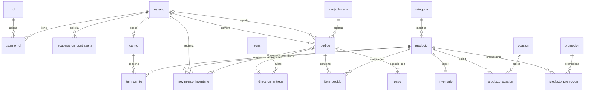

# Modelo físico de la base de datos — Fase 4

**Responsable:** Román Alberto Bolaños Cerquera
**Entregable asociado:** [`scripts/01-crear-tablas.sql`](../scripts/01-crear-tablas.sql)
**Motor:** MySQL 8.0.16 o superior

## 1. Propósito y alcance

Este documento convierte el [modelo integrado](modelo-integrado.md) en un esquema físico
concreto: tipos de datos, longitudes, restricciones, índices y acciones referenciales.
Hay **un único script de creación**, con las mismas 20 entidades del modelo integrado, y
no cuatro scripts incompatibles, uno por aporte.

El script **solo crea la estructura**: no inserta datos.

Insumos utilizados:

| Insumo | Qué se tomó |
| ------ | ----------- |
| [Modelo integrado](modelo-integrado.md) (aportes de Iván, Juan, Steven y Román) | Entidades, atributos, claves, nulabilidad, cardinalidades, reglas de integridad y comportamiento ante eliminación |
| Requerimientos Fase 2 | RF-001 a RF-043 y reglas RN-G1 a RN-G6, RN-01 a RN-48, para justificar restricciones e índices |

## 2. Diagrama del modelo físico



La cardinalidad `pedido ||--|{ pago` (al menos un pago) es la que exige RN-28, pero el
motor no la puede imponer; ver la sección 11.

## 3. Elección de motor

Se adopta **MySQL 8.0.16 o superior**. Tres razones:

- Es el gestor que el modelo lógico de Juan menciona como referencia.
- Desde 8.0.16 las restricciones `CHECK` se **aplican** de verdad; en versiones
  anteriores MySQL las acepta en el DDL y las ignora en silencio, lo que dejaría sin
  efecto reglas como «el precio debe ser mayor que cero».
- La colación `utf8mb4_0900_ai_ci` resuelve de forma nativa dos requisitos del proyecto
  sin código adicional (ver sección 5).

## 4. Convenciones de nomenclatura

| Aspecto | Regla | Ejemplo |
| ------- | ----- | ------- |
| Tablas | minúsculas, snake_case, **singular**, el mismo nombre de la entidad integrada | `item_pedido` |
| Columnas | minúsculas, snake_case, sin tildes ni eñe | `contrasena_hash` |
| Clave primaria | `id_<tabla>` | `id_producto` |
| Clave foránea | `id_<tabla_referenciada>` | `id_categoria` |
| Restricciones | `pk_`, `uq_`, `fk_`, `ck_`, `ix_` + contexto | `ck_producto_precio` |

La entidad `RECUPERACION_CONTRASEÑA` se implementa como `recuperacion_contrasena`:
`CONTRIBUTING.md` exige nombres sin tildes ni caracteres especiales, y una eñe en un
identificador de base de datos es una fuente clásica de problemas de codificación.

## 5. Juego de caracteres y colación

La base se crea con `utf8mb4` y colación por defecto `utf8mb4_0900_ai_ci`
(*accent-insensitive, case-insensitive*). Sostiene dos requisitos directamente:

- **RF-015** — «buscar productos por nombre, sin distinguir mayúsculas ni tildes».
  Con esta colación, `WHERE nombre LIKE '%rosás%'` encuentra «Rosas» sin funciones
  adicionales, y el índice sigue siendo utilizable.
- **RN-01 / RN-33** — correo único. El `UNIQUE` sobre `correo` rechaza
  `ANA@correo.com` si ya existe `ana@correo.com`.

**Dos columnas se salen de esa regla a propósito:** `usuario.contrasena_hash` y
`recuperacion_contrasena.token` se declaran `CHARACTER SET ascii COLLATE ascii_bin`.
Un hash y un token deben compararse byte a byte; compararlos ignorando mayúsculas
debilitaría la verificación.

## 6. Mapeo de dominios lógicos a tipos físicos

| Dominio lógico | Tipo MySQL | Por qué |
| -------------- | ---------- | ------- |
| Identificador de entidad transaccional | `BIGINT UNSIGNED AUTO_INCREMENT` | Crece sin techo práctico; `UNSIGNED` porque un id nunca es negativo |
| Identificador de catálogo pequeño | `SMALLINT UNSIGNED` / `TINYINT UNSIGNED` | Categorías, ocasiones, zonas, franjas y roles se cuentan por decenas |
| Dinero | `DECIMAL(12,2)` | **Nunca `FLOAT` ni `DOUBLE`**: el redondeo binario haría que los totales no cuadren al centavo |
| Porcentaje | `DECIMAL(5,2)` | Admite 0,01 a 100,00 |
| Texto corto | `VARCHAR(n)` con `n` ajustado | La longitud es parte de la regla: ver `dedicatoria` abajo |
| Hash de contraseña | `VARCHAR(255) ascii_bin` | Cabe bcrypt (60) y argon2id (~100), con margen si se cambia de algoritmo (RN-04) |
| Token de recuperación | `CHAR(64) ascii_bin` | Longitud fija de un SHA-256 en hexadecimal |
| Estado / tipo cerrado | `ENUM(...)` | Ver sección 7 |
| Booleano | `BOOLEAN` (`TINYINT(1)`) | `recuperacion_contrasena.utilizado` |
| Fecha | `DATE` | `fecha_ingreso`, `fecha_entrega`, vigencias de promoción |
| Fecha y hora | `DATETIME` | Se prefiere a `TIMESTAMP`: no depende de la zona horaria del servidor |
| Hora | `TIME` | Franjas de entrega |

Un caso donde el tipo **es** la restricción: `pedido.dedicatoria VARCHAR(200)`. RN-26 y
RN-44 fijan el máximo en 200 caracteres, así que el propio tipo lo garantiza.

## 7. Estados: `ENUM` en lugar de tablas de catálogo

Los estados (`usuario.estado`, `producto.estado`, `pedido.estado`,
`movimiento_inventario.tipo`, `pago.metodo`, etc.) se implementan como `ENUM` y no como
tablas con clave foránea. La sección 11 del modelo integrado dejó pendiente definir estas
opciones cerradas; quedaron así:

| Columna | Valores |
| ------- | ------- |
| `usuario.estado` | `ACTIVO`, `DESACTIVADO`, `BLOQUEADO` |
| `categoria.estado`, `ocasion.estado`, `zona.estado`, `franja_horaria.estado` | `ACTIVA`, `INACTIVA` |
| `producto.estado` | `ACTIVO`, `INACTIVO` |
| `promocion.estado` | `ACTIVA`, `INACTIVA`, `FINALIZADA` |
| `pedido.estado` | `CONFIRMADO`, `EN_PREPARACION`, `EN_CAMINO`, `ENTREGADO`, `CANCELADO` (RN-29) |
| `pago.metodo` | `TARJETA`, `TRANSFERENCIA`, `CONTRAENTREGA` |
| `pago.estado` | `APROBADO`, `RECHAZADO` |
| `movimiento_inventario.tipo` | `ENTRADA`, `VENTA`, `MERMA` |

**A favor:** son conjuntos cerrados que solo cambian si cambia el código, ahorran un
`JOIN` en consultas muy frecuentes y el propio motor rechaza un valor no previsto.

**En contra:** agregar un valor exige un `ALTER TABLE`, y el orden de los valores afecta
al `ORDER BY`. Si el negocio necesita administrar estados desde la interfaz, habrá que
migrar a tablas de catálogo. Para el alcance del MVP (R-09) el `ENUM` es suficiente.

## 8. Inventario de tablas

Las mismas 20 entidades del modelo integrado, en el orden en que el script las crea
(cada tabla después de las que referencia).

| # | Tabla | Aporte | Propósito |
| - | ----- | ------ | --------- |
| 1 | `rol` | Iván | Catálogo de roles |
| 2 | `usuario` | Iván | Cuentas registradas |
| 3 | `usuario_rol` | Iván | N:M usuario–rol |
| 4 | `recuperacion_contrasena` | Iván | Solicitudes de recuperación |
| 5 | `categoria` | Juan | Catálogo de categorías |
| 6 | `producto` | Juan | Datos comerciales del producto |
| 7 | `ocasion` | Juan | Catálogo de ocasiones |
| 8 | `promocion` | Juan | Descuentos con vigencia |
| 9 | `producto_ocasion` | Juan | N:M producto–ocasión |
| 10 | `producto_promocion` | Juan | N:M producto–promoción |
| 11 | `zona` | Steven | Zonas con cobertura |
| 12 | `franja_horaria` | Steven | Intervalos de entrega con cupo |
| 13 | `pedido` | Steven | Compra confirmada |
| 14 | `direccion_entrega` | Iván | Dirección del pedido (1:1) |
| 15 | `item_pedido` | Steven | Líneas del pedido con precio congelado |
| 16 | `pago` | Steven | Pagos simulados |
| 17 | `inventario` | Román | Stock y umbral por producto (1:1) |
| 18 | `movimiento_inventario` | Román | Entradas, ventas y mermas |
| 19 | `carrito` | Román | Carrito por cuenta |
| 20 | `item_carrito` | Román | Líneas del carrito |

## 9. Acciones referenciales

Toda clave foránea declara `ON DELETE` y `ON UPDATE`, como exige el README de la fase. El
`ON DELETE` sigue la sección 9 del modelo integrado, que distingue **datos dependientes**
de **historial**:

- **`CASCADE`** cuando la fila hija no tiene sentido sin la padre y no es historial: las
  asignaciones de rol, las solicitudes de recuperación, el carrito y sus ítems, y las
  etiquetas de ocasión y promoción de un producto.
- **`RESTRICT`** cuando borrar la fila padre destruiría historial: todo lo que cuelga de
  `pedido` (ítems, pagos, dirección, movimientos), el inventario y los movimientos de un
  producto (RN-16, RN-39), y las cuentas que compraron.
- **`SET NULL`** en un único caso: `pedido.id_repartidor`. Si se da de baja la cuenta de
  un repartidor, el pedido sigue existiendo y queda sin asignar (RF-034).

`ON UPDATE CASCADE` en todas salvo una: son claves artificiales que no deberían cambiar,
pero si alguna vez hay que corregir una, la corrección se propaga sola. La excepción es
`movimiento_inventario.id_pedido`, con `ON UPDATE RESTRICT` obligatorio: MySQL 8 (error
3823) no permite usar en un `CHECK` una columna cuya FK la modifique, e `id_pedido`
participa en `ck_movimiento_pedido_venta`.

| Tabla hija | FK | Tabla padre | ON DELETE | Motivo |
| ---------- | -- | ----------- | --------- | ------ |
| `usuario_rol` | `id_usuario` | `usuario` | CASCADE | Las asignaciones mueren con la cuenta |
| `usuario_rol` | `id_rol` | `rol` | RESTRICT | Un rol en uso se reasigna antes de borrarse |
| `recuperacion_contrasena` | `id_usuario` | `usuario` | CASCADE | Las solicitudes no sobreviven a la cuenta |
| `producto` | `id_categoria` | `categoria` | RESTRICT | Las categorías se desactivan, no se borran |
| `producto_ocasion` | `id_producto` | `producto` | CASCADE | Etiqueta, no historial |
| `producto_ocasion` | `id_ocasion` | `ocasion` | RESTRICT | No se borra una ocasión en uso |
| `producto_promocion` | ambas | `producto`, `promocion` | CASCADE | Vínculo temporal de campaña |
| `pedido` | `id_usuario` | `usuario` | RESTRICT | Historial de ventas (RF-041) |
| `pedido` | `id_repartidor` | `usuario` | SET NULL | El pedido queda sin asignar (RF-034) |
| `pedido` | `id_franja_horaria` | `franja_horaria` | RESTRICT | No se borra una franja con pedidos |
| `direccion_entrega` | `id_pedido` | `pedido` | RESTRICT | Información histórica de entrega |
| `direccion_entrega` | `id_zona` | `zona` | RESTRICT | RN-23 |
| `item_pedido` | `id_pedido` | `pedido` | RESTRICT | El pedido confirmado es historial |
| `item_pedido` | `id_producto` | `producto` | RESTRICT | RF-042 necesita el producto |
| `pago` | `id_pedido` | `pedido` | RESTRICT | Las transacciones se conservan |
| `inventario` | `id_producto` | `producto` | RESTRICT | El producto se desactiva, no se borra |
| `movimiento_inventario` | `id_producto` | `producto` | RESTRICT | RN-16 / RN-39 |
| `movimiento_inventario` | `id_usuario` | `usuario` | RESTRICT | Auditoría: quién registró |
| `movimiento_inventario` | `id_pedido` | `pedido` | RESTRICT | Trazabilidad de la venta |
| `carrito` | `id_usuario` | `usuario` | CASCADE | Estado temporal, no historial |
| `item_carrito` | `id_carrito` | `carrito` | CASCADE | Línea dependiente |
| `item_carrito` | `id_producto` | `producto` | RESTRICT | Coherente con RN-16 |

## 10. Restricciones que implementan cardinalidades e índices

Cuatro restricciones no son validaciones sino la forma física de una cardinalidad:

| Restricción | Cardinalidad que materializa |
| ----------- | ---------------------------- |
| `pk_inventario(id_producto)`, que además es FK | PRODUCTO 1:1 INVENTARIO |
| `uq_direccion_pedido` en `direccion_entrega(id_pedido)` | PEDIDO 1:1 DIRECCION_ENTREGA |
| `uq_carrito_usuario` en `carrito(id_usuario)` | USUARIO 0..1 CARRITO |
| `uq_item_pedido_producto(id_pedido, id_producto)` | Un producto no se repite en un pedido |

Además de los índices que MySQL crea solo (claves primarias, únicas y el primer campo de
cada FK), se declararon estos:

| Índice | Tabla | Requisito |
| ------ | ----- | --------- |
| `ix_producto_estado_categoria` | `producto` | RF-016, RN-07: catálogo público filtrado por categoría |
| `ix_producto_nombre` | `producto` | RF-015: búsqueda por nombre |
| `ix_producto_estado_precio` | `producto` | RF-017: filtro por rango de precio |
| `ix_promocion_vigencia` | `promocion` | RF-014, RF-022: promociones vigentes al calcular el total |
| `ix_pedido_estado_fecha` | `pedido` | RF-032, RF-043: gestión y reporte por estado |
| `ix_pedido_usuario` | `pedido` | RF-029: historial del cliente |
| `ix_pedido_repartidor` | `pedido` | RF-035: el repartidor ve solo los suyos |
| `ix_pedido_franja_fecha` | `pedido` | RN-24: contar pedidos de una franja en una fecha para validar el cupo |
| `ix_pago_pedido` | `pago` | RF-028: transacciones de un pedido |
| `ix_movimiento_producto_fecha` | `movimiento_inventario` | RF-037: movimientos por producto |
| `ix_movimiento_tipo_fecha` | `movimiento_inventario` | RF-040: mermas por periodo |
| `ix_recuperacion_usuario_vigencia` | `recuperacion_contrasena` | RF-005: solicitud vigente |

Se evitó indexar de más: cada índice acelera lecturas pero encarece cada `INSERT` y
`UPDATE`.

## 11. Reglas que no son declarativas

**Estas reglas no se pueden expresar en el DDL** y tienen que quedar en la capa de
aplicación o en disparadores. Están escritas para que nadie asuma que la base las
garantiza.

| Regla | Por qué no es declarativa | Vía propuesta |
| ----- | ------------------------- | ------------- |
| **RN-19 / RN-42** — una sola promoción activa por producto | Depende de que no se solapen rangos de fechas entre filas distintas; un `UNIQUE` compara valores, no intervalos | Disparador `BEFORE INSERT` en `producto_promocion` o validación en el servicio |
| **RN-28 / RN-46** — todo pedido tiene al menos un pago | Es una cardinalidad mínima 1..N; MySQL no tiene restricciones diferidas | Insertar pedido y pago en una sola transacción SQL |
| **RN-29** — el ciclo de estados del pedido | Un `ENUM` limita *qué* valores son válidos, no *desde cuál* se pasa a cuál | Disparador `BEFORE UPDATE` sobre `pedido.estado` o máquina de estados en la aplicación |
| **RN-G4 / RN-38** — el stock se descuenta al confirmar, vía movimiento | Coordina tres tablas en un mismo acto | Transacción de servicio: `item_pedido`, `movimiento_inventario` tipo `VENTA` y `UPDATE inventario.stock_actual` |
| **RN-24** — cupo de la franja por fecha | El cupo se consume por (franja, fecha) y depende de contar filas de `pedido` | Al confirmar, contar los pedidos no cancelados con `ix_pedido_franja_fecha` dentro de la misma transacción |
| **RN-G1** — la fecha de entrega no puede ser pasada | Un `CHECK` no admite funciones no deterministas como `CURRENT_DATE` | Validación en el servicio al confirmar |
| **Regla 23 del modelo integrado** — el repartidor debe tener rol Repartidor | Depende de otra tabla (`usuario_rol`) | Validación en el servicio al asignar (RF-034) |
| **RF-020** — la cantidad del carrito no supera el stock | Depende de `inventario` | Validación en el servicio al agregar o modificar |

Lo que el DDL **sí** garantiza y conviene no duplicar en código: precio mayor que cero
(RN-09), stock nunca negativo (RN-G3), cantidad mínima de 1 por ítem (RN-11), dedicatoria
de máximo 200 caracteres (RN-26), motivo obligatorio en la merma (RN-G5), `VENTA` siempre
ligada a un pedido y `ENTRADA`/`MERMA` nunca (regla 12), fecha real de entrega presente si
y solo si el pedido está `ENTREGADO` (regla 24) y vigencia de recuperación posterior a su
generación (RN-34).

## 12. Dónde el modelo físico se separa del modelo integrado

El script implementa el modelo integrado tal cual, con estas excepciones. Las dos
primeras son decisiones que el propio modelo integrado dejó al modelo físico; las demás
hay que confirmarlas en equipo.

| # | Punto | Qué hice | Qué falta decidir |
| - | ----- | -------- | ----------------- |
| 1 | `PEDIDO.total` y `ITEM_PEDIDO.subtotal` (pendientes en la sección 11 del integrado) | `total` se persiste como valor histórico; `subtotal` no se almacena porque es `cantidad × precio_unitario` | Nada |
| 2 | El integrado pone la FK de la dirección en **ambos** lados: `PEDIDO.id_direccion_entrega` y `DIRECCION_ENTREGA.id_pedido`, las dos obligatorias | Solo se implementa `direccion_entrega.id_pedido` (FK + UNIQUE). Con las dos obligatorias ninguna fila se puede insertar primero | Nada; quitar `id_direccion_entrega` del diccionario de PEDIDO en el modelo integrado |
| 3 | El integrado no tiene fecha de creación del pedido | Se agrega `pedido.fecha_creacion`: RF-029, RF-032 y RF-043 ordenan y filtran por fecha de compra | Validar la columna añadida |
| 4 | RF-013 (arreglo personalizado, prioridad Baja) no tiene entidad en el modelo integrado | No hay tabla para RF-013 | Si entra al alcance, agregar `solicitud_arreglo_personalizado` al integrado y al script |
| 5 | RF-023 pide «datos del destinatario»; el integrado solo guarda su nombre | Solo `nombre_destinatario` | Si el repartidor necesita llamar al destinatario, agregar `telefono_destinatario` |
| 6 | Diagrama de clases de la Fase 3: `usuario.estado` dice ACTIVO / BLOQUEADO / INACTIVO y la dirección es un `String` dentro de `Pedido` | Seguí al modelo integrado: DESACTIVADO, y dirección como tabla propia | Corregir el diagrama de clases de la Fase 3 |
| 7 | `ciudad` en `direccion_entrega`: si la zona determina una única ciudad, hay dependencia transitiva | Se conserva como fotografía histórica de la entrega | Si la zona fija la ciudad, moverla a `zona` |
| 8 | RN-25 (fechas de alta demanda con cupos distintos) | Sin tabla, igual que el integrado, que lo deja pendiente | Definir con el negocio (R-08) |

## 13. Cómo ejecutar y verificar

```bash
mysql -u root -p --default-character-set=utf8mb4 < docs/fase-4-base-de-datos/scripts/01-crear-tablas.sql
```

> **`--default-character-set=utf8mb4` no es opcional.** Sin ese parámetro el cliente
> `mysql` puede leer el archivo como latin1 y guardar las tildes doblemente codificadas.

Verificación después de ejecutarlo:

```sql
USE floristeria_db;
-- Deben aparecer 20 tablas
SHOW TABLES;
-- Toda tabla con clave primaria: debe devolver 0 filas
SELECT t.table_name
FROM information_schema.tables t
LEFT JOIN information_schema.table_constraints c
  ON c.table_schema = t.table_schema
 AND c.table_name = t.table_name
 AND c.constraint_type = 'PRIMARY KEY'
WHERE t.table_schema = 'floristeria_db' AND c.constraint_name IS NULL;
-- Toda FK con accion declarada: ninguna en NO ACTION
SELECT constraint_name, table_name, delete_rule, update_rule
FROM information_schema.referential_constraints
WHERE constraint_schema = 'floristeria_db';
```

Verificado en MySQL 8.0.46: el script corre desde cero sin errores y crea 20 tablas,
23 claves foráneas, 29 restricciones `CHECK` y 20 índices declarados (los 12 de la
sección 10 más los de apoyo a claves foráneas). Se probó dentro de
transacciones revertidas que las restricciones rechazan los casos inválidos (precio 0,
stock negativo, correo repetido con otra caja, segundo inventario o segunda dirección
para el mismo pedido, `VENTA` sin pedido, merma sin motivo, `ENTREGADO` sin fecha real,
borrar un pedido con pagos, entre otros) y aceptan los válidos.

## 14. Siguientes pasos

- **Jorge** — `scripts/02-datos-prueba.sql` con los `INSERT` de datos de prueba. Este
  script no inserta nada; solo crea la estructura. Para que los `INSERT` no fallen:
  - Respetar el orden de dependencias: `rol`, `usuario`, `usuario_rol`,
    `recuperacion_contrasena` → `categoria`, `ocasion`, `promocion`, `producto`,
    `producto_ocasion`, `producto_promocion`, `inventario` → `zona`, `franja_horaria` →
    `carrito`, `item_carrito` → `pedido`, `direccion_entrega`, `item_pedido`, `pago` →
    `movimiento_inventario`.
  - Cada producto lleva su fila en `inventario`; el stock no está en `producto`.
  - Cada pedido lleva una `direccion_entrega` y al menos un `pago` (RN-28).
  - Un pedido `ENTREGADO` necesita `fecha_hora_entrega_real`; cualquier otro estado la
    deja en `NULL`.
  - Los movimientos `VENTA` llevan `id_pedido`; `ENTRADA` y `MERMA` no, y `MERMA` exige
    `motivo`.
  - Ejecutarlo con `--default-character-set=utf8mb4`, igual que este script (sección 13).
- **Equipo** — los puntos 3 a 8 de la sección 12; el 2 y el 6 exigen corregir el modelo
  integrado y el diagrama de clases de la Fase 3.
